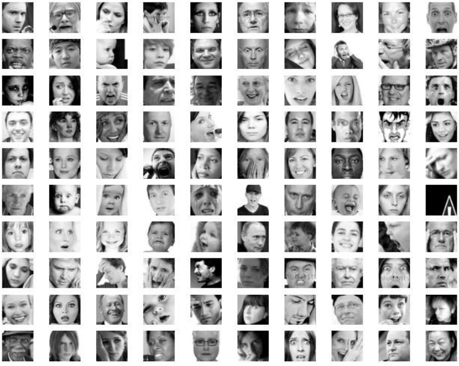
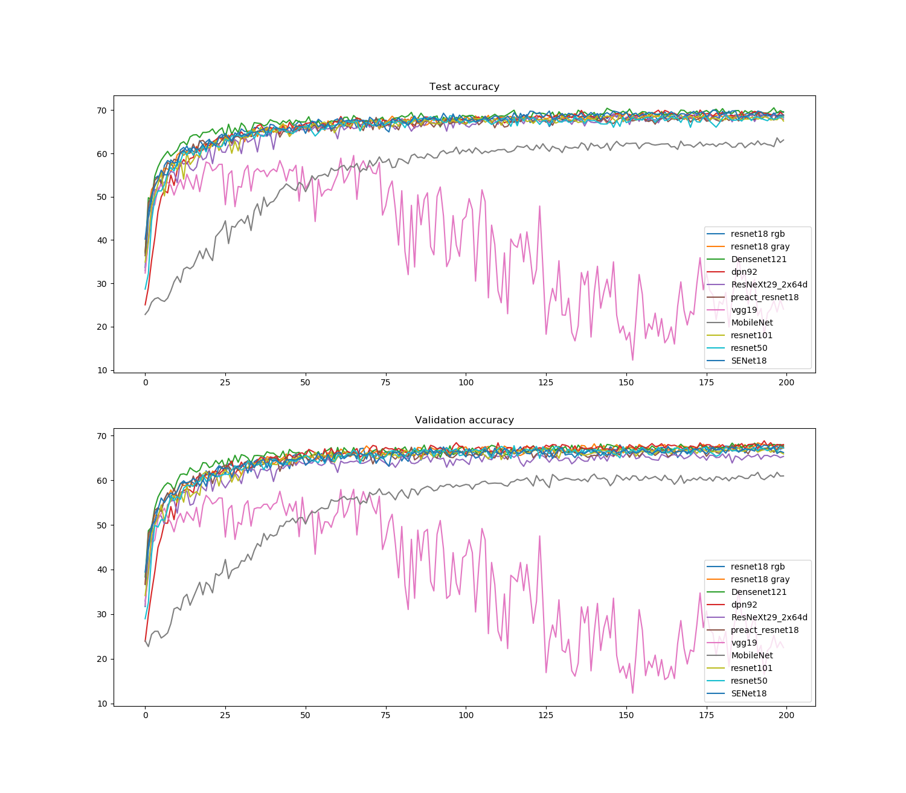
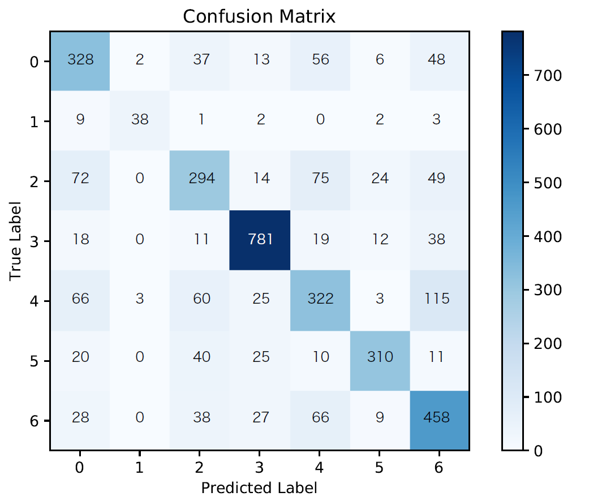

# Fer2013
This repository contains various baseline models for comparison on the *Fer2013* dataset

## Requirements

- [Python 3.7](https://www.python.org/downloads/release/python-370/)
- [NumPy](http://www.numpy.org/)
- [scikit-learn](http://scikit-learn.org/stable/index.html)
- [PyTorch](http://pytorch.org/)

## Usage
### Train a model
`python3 main.py --method Model_Name`

### Test a model
`python3 main.py --method Model_Name --r`

## *Fer2013*

<figure class="half">
    
</figure>

## Deep Convolutional Neural Networks
| Model | dev Accuracy / % | test accuracy / % |
| :---- |:------------:| :---: |
| [ResNet-18](https://arxiv.org/pdf/1512.03385.pdf) | 68.73 | 70.64 |
| [ResNet-50](https://arxiv.org/pdf/1512.03385.pdf) | 68.31 | 70.23 |
| [ResNet-101](https://arxiv.org/pdf/1512.03385.pdf) | 67.61 | 69.09 |
| [DenseNet-121](https://arxiv.org/pdf/1608.06993.pdf) | 68.81 | 71.13 |
| [DPN-92](https://arxiv.org/pdf/1707.01629.pdf) | 69.21 | 70.18 |
| [ResNeXt-29-8x64d](https://arxiv.org/pdf/1611.05431.pdf) | 67.83 | 70.87 |
| [PreAct ResNet](https://arxiv.org/pdf/1603.05027.pdf) | 67.83 | 69.87 |
| [VGG-19](https://arxiv.org/pdf/1409.1556.pdf) | 57.97 | 59.53 |
| [MobileNet](https://arxiv.org/pdf/1704.04861.pdf) | 62.43 | 63.87 |
| [SENet-18](https://arxiv.org/pdf/1709.01507.pdf) | 68.50 | 70.43 |

<figure class="half">
    
</figure>

## Error Analysis
<figure class="half">
    
</figure>

## Adversarial Examples

| Setting                | Dev Accuracy / % | Test accuracy / % |
| :--------------------- | :--------------: | :---------------: |
| No attack+No defense   |       68.7       |       70.6        |
| No attack+Retraining   |       64.3       |       65.6        |
| No attack+Distillation |       67.8       |       69.5        |
|                        |                  |                   |
| FGSM+No defense        |       28.2       |       28.7        |
| FGSM+Retraining        |       26.7       |       27.2        |
| FGSM+Distillation      |       39.0       |       39.6        |
| BIM+No defense         |       28.0       |       28.6        |
| BIM+Retraining         |       25.3       |       26.0        |
| BIM+Distillation       |       38.6       |       39.4        |

## Team Members

- Wendong Bi
- Chen Wang
